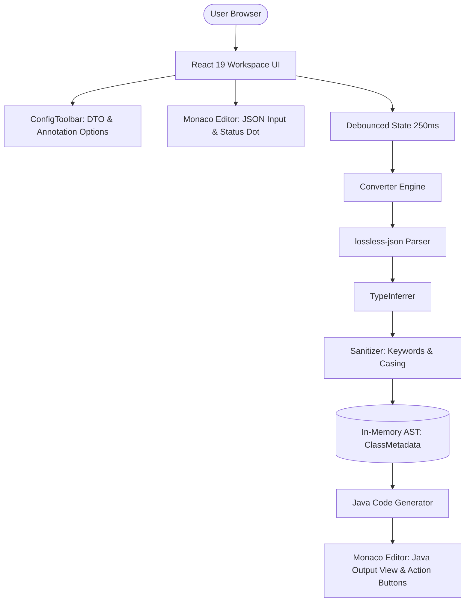

# Architecture Specification

## 1. System Overview & Component Diagram

`2dto` adalah arsitektur Single Page Application (SPA) client-side tanpa dependensi ke backend API atau server eksternal. Seluruh komputasi berlangsung di thread browser pengguna.

---

## 2. Request & Data Flow

1. **Input**: User mengetikkan atau menempelkan payload JSON pada panel Monaco JSON Input.
2. **Debounce (250ms)**: State React mendelay eksekusi konversi selama 250ms untuk menjaga responsivitas UI dan mencegah re-render konstan saat pengetikan.
3. **Lossless Parsing**: String JSON diurai oleh `lossless-json`, menghasilkan token objek JavaScript dengan objek `LosslessNumber` untuk nilai angka agar angka integer 64-bit tidak dibulatkan oleh IEEE-754 double precision float JS engine.
4. **AST Construction & Type Inference**:
   - Tipe numerik dievaluasi: Rentang $[-2^{31}, 2^{31}-1]$ -> `Integer`, rentang $[-2^{63}, 2^{63}-1]$ -> `Long`, di atasnya -> `BigInteger`, angka berkoma -> `Double`.
   - String ISO dievaluasi via regex ISO-8601 -> `Instant` atau `LocalDate`.
   - Array dievaluasi homogen vs heterogen -> `List<T>` atau `List<Object>`.
   - Objek bersarang (*nested objects*) diekstrak secara rekursif menjadi node `ClassMetadata` terpisah.
5. **Sanitization**: Identifiers dibersihkan dari karakter non-alfanumerik, disesuaikan ke PascalCase (nama class) atau camelCase (nama field), serta menangani bentrok kata kunci terlarang Java (`record`, `default`, `class`, dsb.).
6. **Code Generation**:
   - **Mode CLASS**: Menghasilkan Java Class POJO lengkap dengan private fields, constructor tanpa argumen, constructor semua argumen, dan getter/setter.
   - **Mode RECORD**: Menghasilkan Java 17 canonical record parameters.
   - **Lombok Check**: Jika diaktifkan, kelas menggunakan anotasi `@Data`, `@NoArgsConstructor`, `@AllArgsConstructor`, dan opsional `@Builder`.
   - **JsonProperty Check**: Jika diaktifkan, menyematkan anotasi `@JsonProperty("key")` pada seluruh field. Jika tidak diaktifkan, anotasi `@JsonProperty` tetap **dipaksa secara otomatis** pada field yang bentrok dengan kata kunci terlarang Java (misal: `class`, `default`, `import`, dsb.) beserta impor Jackson-nya untuk mencegah kegagalan deserialisasi.
   - **Jakarta Validation Check**: Jika diaktifkan, menambahkan `@NotNull` dan `@Valid` (pada sub-objek).
7. **Rendering & Syntax Highlighting**:
   - String kode Java dirender pada panel Monaco Editor sebelah kanan (read-only mode).
   - Saat dark mode aktif, panel output Java menerapkan custom theme **One Dark** yang diperkaya via custom Monarch tokenizer (`monaco.languages.setMonarchTokensProvider`):
     - Modifiers (`private`, `public`, `class`, dsb.): **ungu** (`#c678dd`)
     - Collections (`List`, `Map`): **hijau** (`#98c379`)
     - Standard Types / Classes (`String`, `Long`, DTO classes, primitif): **kuning emas** (`#e5c07b`)
     - Field / Variable Identifiers: **merah** (`#e06c75`)
     - Delimiters & brackets: **abu-abu One Dark** (`#abb2bf`)
   - Saat light mode aktif, editor beralih ke tema `vs`.

---

## 3. Concurrency & Resource Management
- **Single-Threaded Event Loop**: Berjalan sepenuhnya di UI thread browser via asynchronous debounce timer (`setTimeout`).
- **Memory Consumption**: Bersifat transien in-memory; AST dibersihkan dan dialokasikan ulang setiap kali JSON valid diproses. Tidak ada caching jangka panjang atau leak DOM node.

---

## 4. Error Handling & Fault Tolerance
- **JSON Syntax Errors**: Ditangkap via blok `try/catch` pada parsing level. Jika parsing gagal, error ditampilkan secara non-blocking melalui banner merah di bawah input editor tanpa merusak state aplikasi sebelumnya.
- **Malformed Arrays / Mixed Primitives**: Fallback aman ke `List<Object>`.
- **Null Values**: Diberi fallback aman bertipe `Object`.

---

## 5. Observability & Telemetry
- **Air-Gapped Privacy (Zero Network Outbound)**: Aplikasi tidak memuat Google Analytics, Sentry, Telemetry beacons, atau tracking cookies.
- **Client Logging**: Hanya memanfaatkan `console.error` saat terjadi kegagalan clipboard API.

---

## 6. Data & Domain Boundaries
- `ConverterConfig`: Parameter konfigurasi yang dikendalikan oleh user.
- `FieldMetadata`: Representasi satu properti objek JSON yang telah dipetakan ke tipe Java.
- `ClassMetadata`: Representasi sebuah class atau record Java independen.
- `ConversionResult`: Bundle output string kode Java dan daftar metadata class yang dihasilkan.
